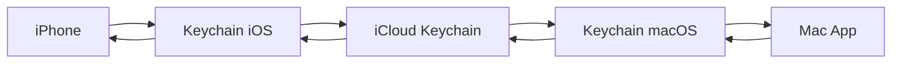

# Guide de Configuration : Synchronisation iCloud Keychain

Ce guide vous explique comment configurer et utiliser la synchronisation des credentials entre iPhone et Mac.

## 🎯 Objectif

Synchroniser automatiquement vos credentials S3 entre tous vos appareils Apple de manière sécurisée.

## 📋 Prérequis

### Appareils
- iPhone/iPad avec iOS 13+ 
- Mac avec macOS 10.15+
- Apple Watch (optionnel)

### Configuration Apple
- Même Apple ID sur tous les appareils
- iCloud activé
- Keychain iCloud activé

## 🛠️ Configuration

### 1. Vérifier iCloud Keychain

#### Sur iPhone/iPad :
1. Réglages → [Votre nom] → iCloud
2. Trousseaux → Activé ✅
3. Vérifier que la synchronisation fonctionne

#### Sur Mac :
1. Préférences Système → Apple ID → iCloud
2. Trousseau → Activé ✅
3. Ou via Terminal : `security show-keychain-info`

### 2. Configuration App

L'application est automatiquement configurée avec :

```typescript
// Keychain Access Group
keychainAccessGroup: 'group.com.vincentventalon.universals3client.shared'

// Options de sécurité
keychainAccessible: SecureStore.AFTER_FIRST_UNLOCK
requireAuthentication: false
```

## 🔄 Comment ça marche

### Workflow de synchronisation



### 1. Première configuration (iPhone)
1. Ouvrir l'app Universal S3 Client
2. Créer votre mot de passe maître
3. Ajouter vos providers S3
4. 💾 Données sauvegardées dans Keychain
5. ☁️ Synchronisation automatique vers iCloud

### 2. Configuration sur Mac
1. Installer l'app Mac (quand disponible)
2. Entrer le même mot de passe maître
3. 📱 Les providers apparaissent automatiquement
4. ✅ Synchronisation bidirectionnelle active

## 🔐 Sécurité

### Chiffrement
- **AES-256** pour les données
- **Keychain natif** pour le stockage
- **Chiffrement de bout en bout** via iCloud

### Protection
- Mot de passe maître requis
- Données chiffrées avant stockage
- Pas d'accès sans authentification

### Architecture
```
Credentials → AES Encryption → iOS Keychain → iCloud → macOS Keychain → Mac App
```

## 📊 Indicateurs de statut

L'app affiche des indicateurs visuels :

| Icône | Statut | Description |
|-------|--------|-------------|
| ☁️✅ | Synchronisé | Données disponibles sur iCloud |
| ☁️⚪ | Non synchronisé | Données locales uniquement |
| ☁️❌ | Erreur | Problème de synchronisation |

## 🐛 Dépannage

### Synchronisation lente
- **Délai normal** : 5-10 minutes
- **Forcer sync** : Redémarrer l'app
- **Vérifier** : Connexion internet stable

### Données manquantes
1. Vérifier iCloud Keychain activé
2. Même Apple ID sur les appareils
3. Mot de passe maître identique
4. Attendre quelques minutes

### Erreurs communes

#### "Key not found"
```
Solution : 
1. Vérifier mot de passe maître
2. Réinstaller si nécessaire
3. Reconfigurer providers
```

#### "Sync failed"
```
Solution :
1. Vérifier connexion iCloud
2. Se déconnecter/reconnecter iCloud
3. Redémarrer appareil
```

## 🔧 Développement

### Build requirements
```bash
# Development build nécessaire pour test
npx expo install expo-dev-client
eas build --profile development --platform ios
```

### Configuration native
```javascript
// app.json
"entitlements": {
  "keychain-access-groups": [
    "$(AppIdentifierPrefix)group.com.vincentventalon.universals3client.shared"
  ]
}
```

### Tests
```javascript
// Vérifier sync
import { SyncService } from './src/services/syncService';

const syncInfo = await SyncService.getLastSyncInfo();
console.log('Last sync:', syncInfo.timestamp);
```

## 📱 Utilisation quotidienne

### Scénario : Nouveau provider sur iPhone
1. Ajouter provider dans l'app iPhone
2. ⏱️ Attendre 2-5 minutes
3. Ouvrir app Mac
4. ✅ Provider disponible automatiquement

### Scénario : Modification sur Mac
1. Modifier credentials sur Mac
2. ☁️ Sync automatique vers iCloud
3. 📱 Changements disponibles sur iPhone
4. 🔄 Bidirectionnel et transparent

## 🆘 Support

### Logs utiles
```javascript
// Dans DevTools/Console
console.log('Sync status:', await SyncService.getLastSyncInfo());
```

### Contacts
- GitHub Issues pour bugs
- Documentation technique dans `/docs`
- Community Discord (lien dans README)

## 🚀 Prochaines étapes

1. **App Mac native** (en développement)
2. **iPad support** optimisé
3. **Sync indicators** avancés
4. **Backup/restore** manuel

---

**Note** : Cette fonctionnalité nécessite iOS 13+ et est optimisée pour l'écosystème Apple. La synchronisation inter-plateformes (Android ↔ iOS) n'est pas supportée nativement.